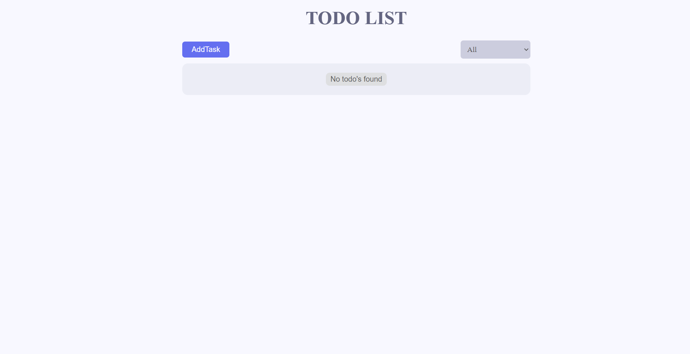
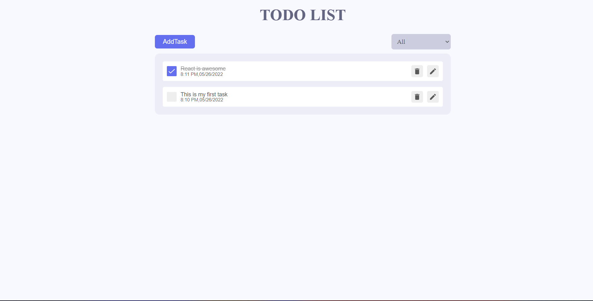
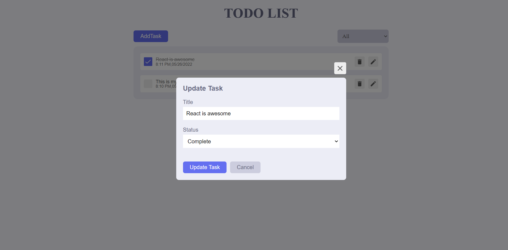

# React Todo App.

A todo application made using react.

**live demo: [https://pranavelric.dev/React-TODO-APP/](https://pranavelric.dev/React-TODO-APP/)**


## Libraries used

- [React](https://reactjs.org/)
- [React Redux](https://redux.js.org/)
- [Framer Motion](https://framer.com/motion/)
- [React icons](https://react-icons.netlify.com/)
- [React Hot Toast](https://react-hot-toast.com/)


## Instructions

First clone this repository.
```bash
$ git clone https://github.com/pranavelric/React-TODO-APP.git
```

Install dependencies. Make sure you already have [`nodejs`](https://nodejs.org/en/) & [`npm`](https://www.npmjs.com/) installed in your system.
```bash
$ npm install # or yarn
```

Run it
```bash
$ npm start # or yarn start
```

## Screenshots






